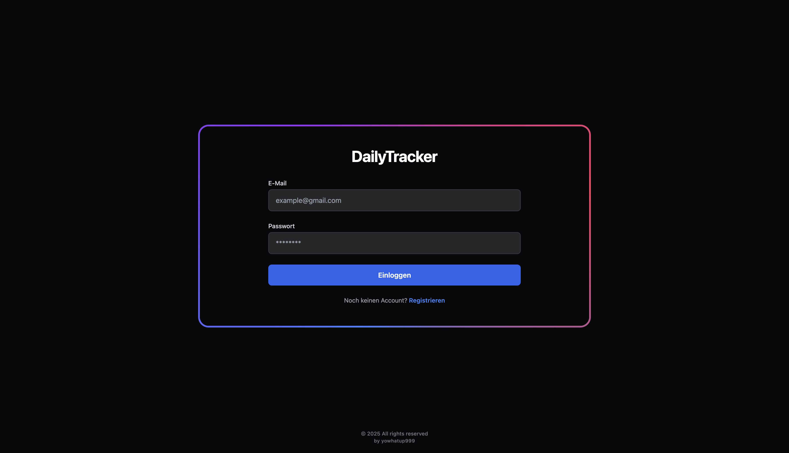
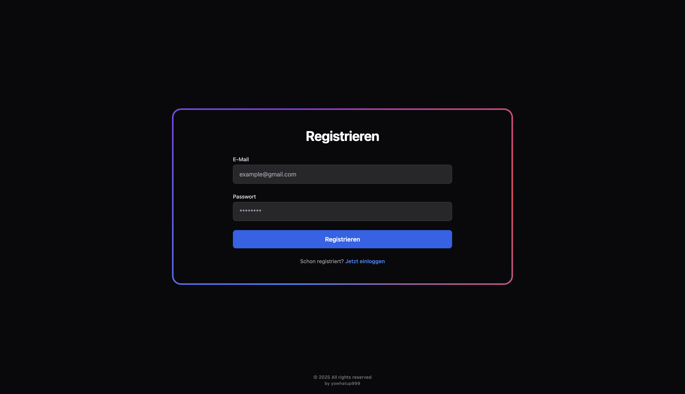
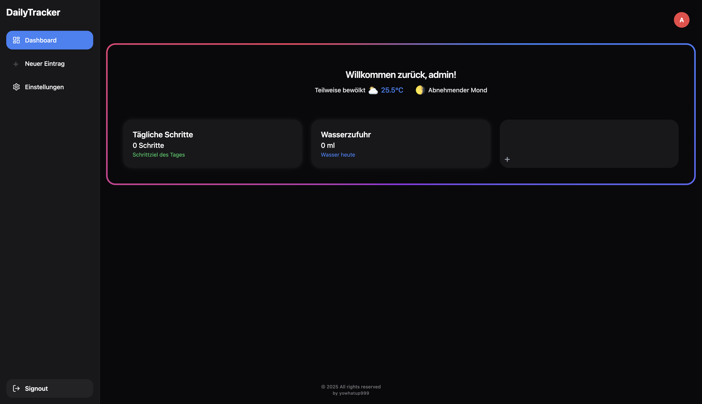
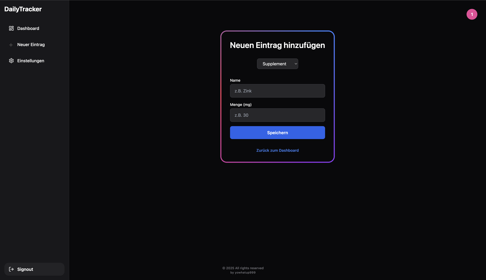

# DailyTracker

Ein persönliches Health- und Lifestyle-Tracking-Tool.

---

## Vorschau

| Login | Registrierung | Dashboard | Supplement-Verwaltung |
|-------|---------------|-----------|-----------------------|
|  |  |  |  |

---

## Ziel

Mit DailyTracker können Nutzer ihre täglichen Gesundheitsdaten einfach erfassen:

- Schritte
- Schlafdauer
- Wasserzufuhr
- Supplemente (mit mg-Angabe)
- Trainingseinheiten
- Custom Einträge

Zusätzlich werden Wetterdaten und die aktuelle Mondphase automatisch geladen (z. B. für bessere Auswertung der Schlafqualität).

---

## Tech-Stack

- **Backend:** Java 21 mit Spring Boot  
- **Frontend:** React (Vite)
- **Datenbank:** PostgreSQL
- **API-Integration:** Open-Meteo (Wetter), Mondphase

---

## Features

- Benutzer-Login (JWT-Auth)
- Tagesübersicht mit schnellen Eingaben
- Automatischer Wetter- und Mondimport
- Supplement-Verwaltung mit mg-Angabe
- Historie mit Filterfunktion
- Statistikmodul (z. B. Schlaf-Schnitt, Schritt-Ziele)
- (optional) Schritt-Import von iPhone Health API

---

## Status

🚀 **Release-Ready**  
Frontend und Backend laufen containerisiert mit Docker.  
Alle Basis-Features funktionieren, Feinschliff/UX folgt laufend.

---

## Installation (lokal, mit Docker Compose)

**Voraussetzungen:**  
- Docker & Docker Compose installiert

**Start:**
```bash
cd infra
docker-compose up --build
