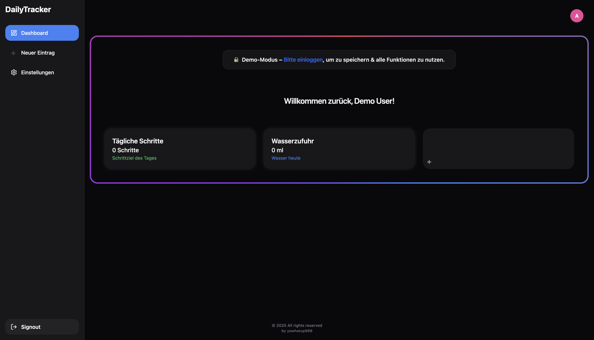

# DailyTracker


Ein persönliches Health- und Lifestyle-Tracking-Tool.

---

## Vorschau

| Dashboard (Demo)                     |
|--------------------------------------|
|  |

Weitere Screenshots:

| Login                               | Registrierung                        | Supplement-Verwaltung                |
|-------------------------------------|--------------------------------------|--------------------------------------|
|  |  |  |

---

## Ziel

Mit DailyTracker kannst du deine wichtigsten Gesundheitsdaten einfach erfassen und auswerten:

- Schritte
- Schlafdauer
- Wasserzufuhr
- Supplemente (inkl. mg)
- Trainingseinheiten
- Eigene Einträge

Wetter und Mondphase werden automatisch geladen und für die Analyse genutzt (z. B. Schlafqualität).

---

## Tech-Stack

- **Backend:** Java 21 (Spring Boot)
- **Frontend:** React (Vite)
- **Datenbank:** PostgreSQL
- **APIs:** Open-Meteo (Wetter), Mondphase

---

## Features

- JWT-Login (Backend)
- Tagesübersicht mit Schnell-Eingaben
- Automatische Wetter- und Mondphasen-Daten
- Supplemente inkl. mg-Verwaltung
- Verlauf und Filter-Optionen
- Statistik (z. B. Schlaf-Schnitt, Schrittziele)
- (optional) Schritt-Import via iPhone Health API

---

## Status

🚀 **Release-Ready**  
Frontend & Backend laufen containerisiert mit Docker.  
Alle Haupt-Features laufen, Feinschliff & UX werden laufend verbessert.

---

## Installation (Lokal mit Docker Compose)

**Voraussetzung:**  
- Docker & Docker Compose installiert

**Start:**
```bash
cd infra
docker-compose up --build
